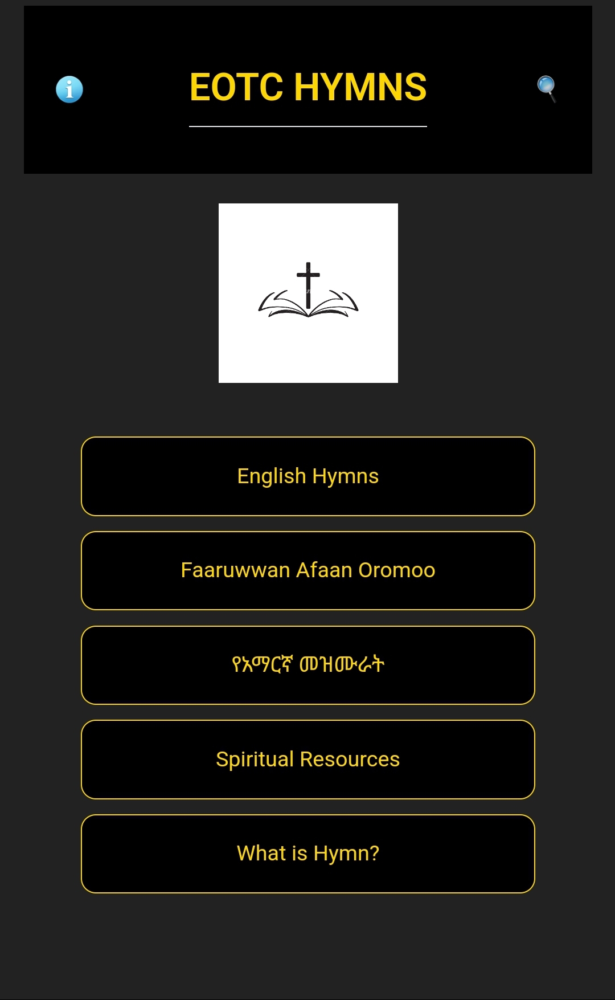
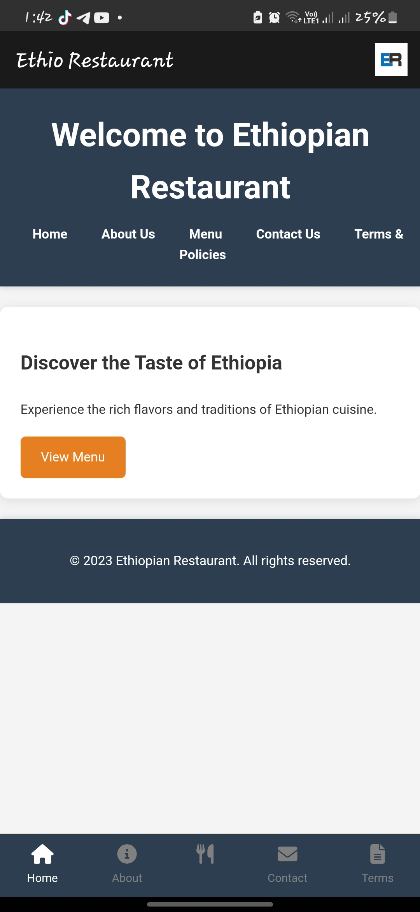

<!DOCTYPE html>
<html lang="en">
<head>
    <meta charset="UTF-8">
    <meta name="viewport" content="width=device-width, initial-scale=1.0">
    <title>Eyob Portfolio</title>
    <link rel="stylesheet" href="styles.css">
     <!-- Font Awesome for icons -->
</head>
<body>
    <!-- Header -->
    <header>
        <nav>
            <ul>
                <li><a href="#home">Home</a></li>
                <li><a href="#about">About</a></li>
                <li><a href="#skills">Skills</a></li>
                <li><a href="#projects">Projects</a></li>
                <li><a href="#contact">Contact</a></li>
            </ul>
        </nav>
    </header>

    <!-- Home Section -->
    <section id="home">
        

            
            <h1>Welcome to My Portfolio</h1>
            
Hi, I'm Eyob. I'm a passionate developer.

        

    </section>

    <!-- About Section -->
    <section id="about">
        <h2>About Me</h2>
        
A brief introduction about myself, my background, and my goals. I specialize in web development and creating beautiful, functional websites.

    </section>

    <!-- Skills Section -->
    <section id="skills">
        <h2>My Skills</h2>
        <ul>
            <li>HTML</li>
            <li>CSS</li>
            <li>JavaScript</li>
            <li>Responsive Design</li>
        </ul>
    </section>

    <!-- Projects Section -->
    <section id="projects">
        <h2>My Projects</h2>
        

            

                
                <h3>Project 1</h3>
                
Description of Project 1.

                <a href="#" class="btn">View Project</a>
            

            

                
                <h3>Project 2</h3>
                
Description of Project 2.

                <a href="#" class="btn">View Project</a>
            

            

                
                <h3>Project 3</h3>
                
Description of Project 3.

                <a href="#" class="btn">View Project</a>
            

        

    </section>

    <!-- Contact Section -->
    <section id="contact">
        <h2>Contact Me</h2>
        
Feel free to reach out using the methods below:

        <ul class="contact-info">
            <li><strong>Phone:</strong> +251985754689</li>
            <li><strong>Email:</strong> <a href="mailto:eyob0081@gmail.com">eyob0081@gmail.com</a></li>
            <li><strong>TikTok:</strong> <a href="https://www.tiktok.com/@softrum_01" target="_blank">@softrum_01</a></li>
            <li><strong>Telegram:</strong> <a href="https://t.me/your_telegram_username" target="_blank">Telegram Link</a></li>
        </ul>
    </section>

    <!-- Footer -->
    <footer>
        
&copy; 2023 Eyob. All rights reserved.

    </footer>

    
</body>
</html>
